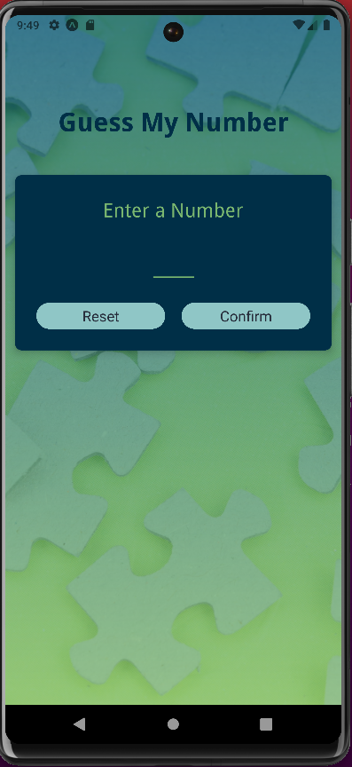
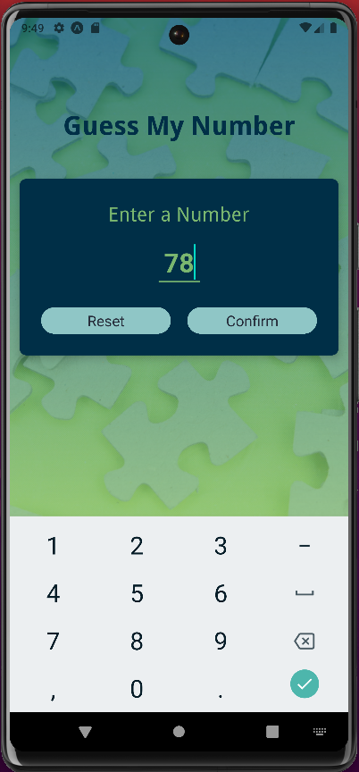
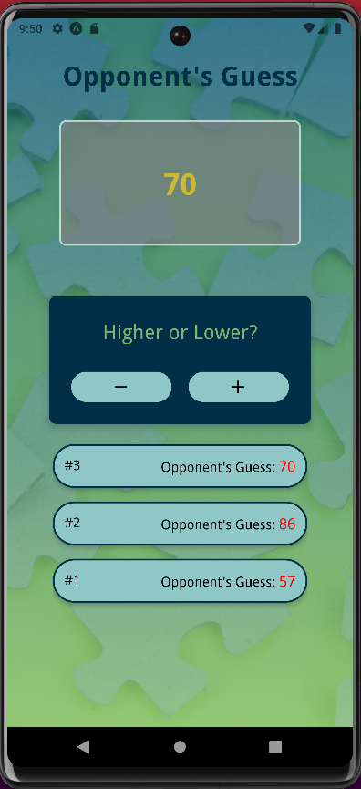
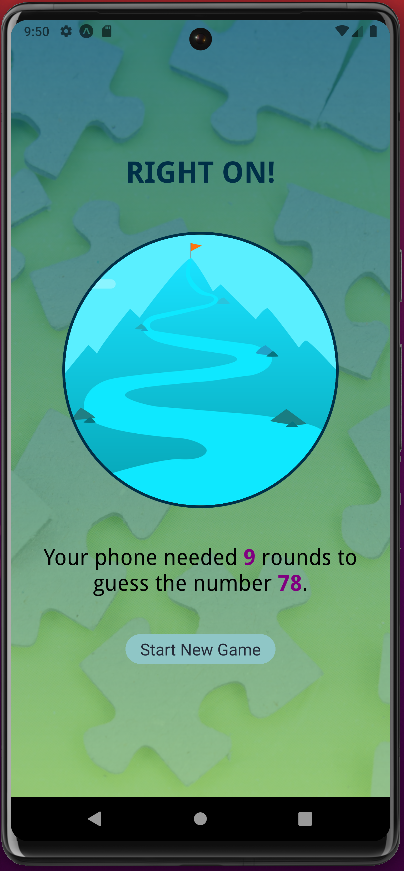

# "Guess My Number"
### A React Native Mobile App

This app is still being constructed, and is not yet deployed for public use.  You can, however clone, install, and test on your local device.  

### What You'll Need to do:

- Clone this repository to your local machine 
- Open your terminal, navigate to the new file, and run `npm install`, then `npm start` 
- ** You will need to download, install, and run expo go and Adroid Studio to simulate a mobile device, or connect it to your physical mobile device.  The instructions to do this are in the expo go and Android Studio documents.

### Links
[www.williamlowrimore.com](https://www.williamlowrimore.com) 

[wlowrimore@gmail.com](mailto:wlowrimore@gmail.com) 

[www.linkedin.com](www.linkedin.com/in/william-lowrimore-21778310)